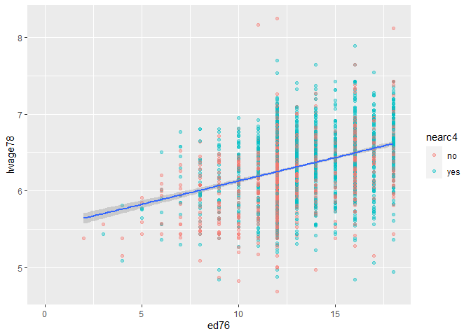
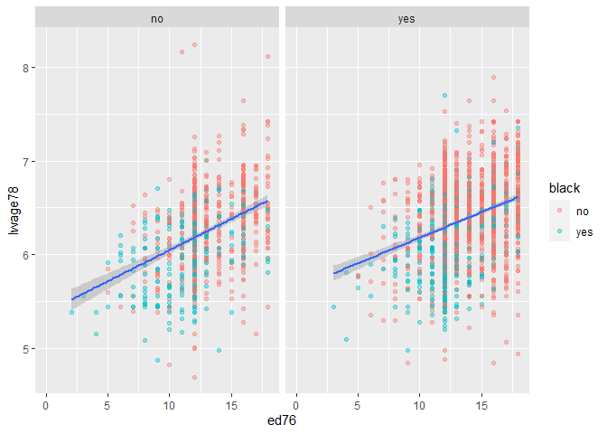
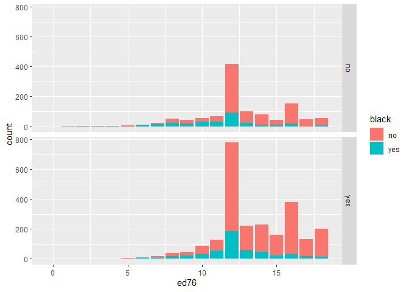

This is a markdown file created using RStudio.

### Using Packeges
I used these packages to create the data:


```r
library(tidyverse)
library(knitr)
library(magrittr)
library(AER)
library(broom)
```


## Tidy the Data
### Importing Data
 
I used the data from [David Card's website](https://davidcard.berkeley.edu/data_sets.html) 
The relevant file is `nls.dat` saved in the `Data` directory.


```r
data <- read.table("Data/nls.dat") %>% as_data_frame()
head(data)
```

<div data-pagedtable="false">
  <script data-pagedtable-source type="application/json">
{"columns":[{"label":["V1"],"name":[1],"type":["int"],"align":["right"]},{"label":["V2"],"name":[2],"type":["int"],"align":["right"]},{"label":["V3"],"name":[3],"type":["int"],"align":["right"]},{"label":["V4"],"name":[4],"type":["int"],"align":["right"]},{"label":["V5"],"name":[5],"type":["int"],"align":["right"]},{"label":["V6"],"name":[6],"type":["int"],"align":["right"]},{"label":["V7"],"name":[7],"type":["int"],"align":["right"]},{"label":["V8"],"name":[8],"type":["int"],"align":["right"]},{"label":["V9"],"name":[9],"type":["dbl"],"align":["right"]},{"label":["V10"],"name":[10],"type":["int"],"align":["right"]},{"label":["V11"],"name":[11],"type":["dbl"],"align":["right"]},{"label":["V12"],"name":[12],"type":["int"],"align":["right"]},{"label":["V13"],"name":[13],"type":["int"],"align":["right"]},{"label":["V14"],"name":[14],"type":["int"],"align":["right"]},{"label":["V15"],"name":[15],"type":["int"],"align":["right"]},{"label":["V16"],"name":[16],"type":["int"],"align":["right"]},{"label":["V17"],"name":[17],"type":["int"],"align":["right"]},{"label":["V18"],"name":[18],"type":["int"],"align":["right"]},{"label":["V19"],"name":[19],"type":["int"],"align":["right"]},{"label":["V20"],"name":[20],"type":["int"],"align":["right"]},{"label":["V21"],"name":[21],"type":["int"],"align":["right"]},{"label":["V22"],"name":[22],"type":["int"],"align":["right"]},{"label":["V23"],"name":[23],"type":["int"],"align":["right"]},{"label":["V24"],"name":[24],"type":["int"],"align":["right"]},{"label":["V25"],"name":[25],"type":["int"],"align":["right"]},{"label":["V26"],"name":[26],"type":["int"],"align":["right"]},{"label":["V27"],"name":[27],"type":["int"],"align":["right"]},{"label":["V28"],"name":[28],"type":["int"],"align":["right"]},{"label":["V29"],"name":[29],"type":["chr"],"align":["left"]},{"label":["V30"],"name":[30],"type":["chr"],"align":["left"]},{"label":["V31"],"name":[31],"type":["int"],"align":["right"]},{"label":["V32"],"name":[32],"type":["int"],"align":["right"]},{"label":["V33"],"name":[33],"type":["int"],"align":["right"]},{"label":["V34"],"name":[34],"type":["chr"],"align":["left"]},{"label":["V35"],"name":[35],"type":["int"],"align":["right"]},{"label":["V36"],"name":[36],"type":["chr"],"align":["left"]},{"label":["V37"],"name":[37],"type":["chr"],"align":["left"]},{"label":["V38"],"name":[38],"type":["int"],"align":["right"]},{"label":["V39"],"name":[39],"type":["chr"],"align":["left"]},{"label":["V40"],"name":[40],"type":["chr"],"align":["left"]},{"label":["V41"],"name":[41],"type":["chr"],"align":["left"]},{"label":["V42"],"name":[42],"type":["int"],"align":["right"]},{"label":["V43"],"name":[43],"type":["int"],"align":["right"]},{"label":["V44"],"name":[44],"type":["int"],"align":["right"]},{"label":["V45"],"name":[45],"type":["chr"],"align":["left"]},{"label":["V46"],"name":[46],"type":["chr"],"align":["left"]},{"label":["V47"],"name":[47],"type":["chr"],"align":["left"]},{"label":["V48"],"name":[48],"type":["chr"],"align":["left"]},{"label":["V49"],"name":[49],"type":["chr"],"align":["left"]},{"label":["V50"],"name":[50],"type":["chr"],"align":["left"]},{"label":["V51"],"name":[51],"type":["chr"],"align":["left"]},{"label":["V52"],"name":[52],"type":["chr"],"align":["left"]}],"data":[{"1":"2","2":"0","3":"0","4":"0","5":"0","6":"7","7":"5","8":"29","9":"9.94","10":"1","11":"10.25","12":"1","13":"158413","14":"1","15":"0","16":"0","17":"1","18":"0","19":"0","20":"0","21":"0","22":"0","23":"0","24":"0","25":"0","26":"0","27":"1","28":"1","29":"6.30627529","30":"6.07484616","31":"9","32":"1","33":"1","34":"1","35":"0","36":"0","37":"0","38":"1","39":"548","40":"500","41":"755","42":"0","43":"0","44":"0","45":"0","46":"0","47":"15","48":".","49":"1","50":"1","51":"1","52":"0"},{"1":"3","2":"0","3":"0","4":"0","5":"0","6":"12","7":"11","8":"27","9":"8.00","10":"0","11":"8.00","12":"0","13":"380166","14":"1","15":"0","16":"0","17":"1","18":"0","19":"0","20":"0","21":"0","22":"0","23":"0","24":"0","25":"0","26":"0","27":"1","28":"0","29":"6.17586727","30":".","31":"8","32":"0","33":"1","34":"1","35":"0","36":"0","37":"0","38":"1","39":"481","40":".","41":"769","42":"0","43":"0","44":"0","45":"0","46":"0","47":"35","48":"93","49":"1","50":"4","51":"4","52":"1"},{"1":"4","2":"0","3":"0","4":"0","5":"0","6":"12","7":"12","8":"34","9":"14.00","10":"0","11":"12.00","12":"0","13":"367470","14":"1","15":"0","16":"0","17":"1","18":"0","19":"0","20":"0","21":"0","22":"0","23":"0","24":"0","25":"0","26":"0","27":"1","28":"0","29":"6.58063914","30":".","31":"2","32":"0","33":"1","34":".","35":"0","36":".","37":".","38":"1","39":"721","40":".","41":".","42":"1","43":"1","44":"0","45":".","46":".","47":"42","48":"103","49":"1","50":".","51":".","52":"1"},{"1":"5","2":"1","3":"1","4":"1","5":"0","6":"11","7":"11","8":"27","9":"11.00","10":"0","11":"12.00","12":"0","13":"380166","14":"1","15":"0","16":"0","17":"0","18":"1","19":"0","20":"0","21":"0","22":"0","23":"0","24":"0","25":"0","26":"0","27":"1","28":"0","29":"5.52146092","30":".","31":"6","32":"0","33":"1","34":".","35":"0","36":".","37":"0","38":"1","39":"250","40":".","41":".","42":"1","43":"0","44":"0","45":".","46":"0","47":"25","48":"88","49":"1","50":".","51":"5","52":"1"},{"1":"6","2":"1","3":"1","4":"1","5":"0","6":"12","7":"12","8":"34","9":"8.00","10":"0","11":"7.00","12":"0","13":"367470","14":"1","15":"0","16":"0","17":"0","18":"1","19":"0","20":"0","21":"0","22":"0","23":"0","24":"0","25":"0","26":"0","27":"1","28":"1","29":"6.59167373","30":"6.54484979","31":"8","32":"0","33":"1","34":"1","35":"0","36":"0","37":".","38":"1","39":"729","40":"800","41":".","42":"0","43":"1","44":"0","45":"0","46":".","47":"34","48":"108","49":"1","50":"1","51":".","52":"0"},{"1":"7","2":"1","3":"1","4":"1","5":"0","6":"12","7":"11","8":"26","9":"9.00","10":"0","11":"12.00","12":"0","13":"380166","14":"1","15":"0","16":"0","17":"0","18":"1","19":"0","20":"0","21":"0","22":"0","23":"0","24":"0","25":"0","26":"0","27":"1","28":"1","29":"6.21460810","30":"6.19351769","31":"6","32":"0","33":"1","34":"1","35":"0","36":"0","37":"0","38":"1","39":"500","40":"563","41":"630","42":"0","43":"0","44":"0","45":"0","46":"0","47":"38","48":"85","49":"1","50":"4","51":"4","52":"1"}],"options":{"columns":{"min":{},"max":[10]},"rows":{"min":[10],"max":[10]},"pages":{}}}
  </script>
</div>
### Changing col names & type

Using variable names from `code_bk.txt'


```r
colnames(data) <-(c("id","nearc2","nearc4","nearc4a","nearc4b","ed76","ed66","age76","daded","nodaded","momed","nomomed","weight","momdad14","sinmom14","step14","reg661","reg662","reg663","reg664","reg665","reg666","reg667","reg668","reg669","south66","work76","work78","lwage76","lwage78","famed","black","smsa76r","smsa78r","reg76r","reg78r","reg80r","smsa66r","wage76","wage78","wage80","noint78","noint80","enroll76","enroll78","enroll80","kww","iq","marsta76","marsta78","marsta80","libcrd14"))

data %<>% mutate_if(is_character,suppressWarnings(as.numeric))
head(data)
```

<div data-pagedtable="false">
  <script data-pagedtable-source type="application/json">
{"columns":[{"label":["id"],"name":[1],"type":["int"],"align":["right"]},{"label":["nearc2"],"name":[2],"type":["int"],"align":["right"]},{"label":["nearc4"],"name":[3],"type":["int"],"align":["right"]},{"label":["nearc4a"],"name":[4],"type":["int"],"align":["right"]},{"label":["nearc4b"],"name":[5],"type":["int"],"align":["right"]},{"label":["ed76"],"name":[6],"type":["int"],"align":["right"]},{"label":["ed66"],"name":[7],"type":["int"],"align":["right"]},{"label":["age76"],"name":[8],"type":["int"],"align":["right"]},{"label":["daded"],"name":[9],"type":["dbl"],"align":["right"]},{"label":["nodaded"],"name":[10],"type":["int"],"align":["right"]},{"label":["momed"],"name":[11],"type":["dbl"],"align":["right"]},{"label":["nomomed"],"name":[12],"type":["int"],"align":["right"]},{"label":["weight"],"name":[13],"type":["int"],"align":["right"]},{"label":["momdad14"],"name":[14],"type":["int"],"align":["right"]},{"label":["sinmom14"],"name":[15],"type":["int"],"align":["right"]},{"label":["step14"],"name":[16],"type":["int"],"align":["right"]},{"label":["reg661"],"name":[17],"type":["int"],"align":["right"]},{"label":["reg662"],"name":[18],"type":["int"],"align":["right"]},{"label":["reg663"],"name":[19],"type":["int"],"align":["right"]},{"label":["reg664"],"name":[20],"type":["int"],"align":["right"]},{"label":["reg665"],"name":[21],"type":["int"],"align":["right"]},{"label":["reg666"],"name":[22],"type":["int"],"align":["right"]},{"label":["reg667"],"name":[23],"type":["int"],"align":["right"]},{"label":["reg668"],"name":[24],"type":["int"],"align":["right"]},{"label":["reg669"],"name":[25],"type":["int"],"align":["right"]},{"label":["south66"],"name":[26],"type":["int"],"align":["right"]},{"label":["work76"],"name":[27],"type":["int"],"align":["right"]},{"label":["work78"],"name":[28],"type":["int"],"align":["right"]},{"label":["lwage76"],"name":[29],"type":["dbl"],"align":["right"]},{"label":["lwage78"],"name":[30],"type":["dbl"],"align":["right"]},{"label":["famed"],"name":[31],"type":["int"],"align":["right"]},{"label":["black"],"name":[32],"type":["int"],"align":["right"]},{"label":["smsa76r"],"name":[33],"type":["int"],"align":["right"]},{"label":["smsa78r"],"name":[34],"type":["dbl"],"align":["right"]},{"label":["reg76r"],"name":[35],"type":["int"],"align":["right"]},{"label":["reg78r"],"name":[36],"type":["dbl"],"align":["right"]},{"label":["reg80r"],"name":[37],"type":["dbl"],"align":["right"]},{"label":["smsa66r"],"name":[38],"type":["int"],"align":["right"]},{"label":["wage76"],"name":[39],"type":["dbl"],"align":["right"]},{"label":["wage78"],"name":[40],"type":["dbl"],"align":["right"]},{"label":["wage80"],"name":[41],"type":["dbl"],"align":["right"]},{"label":["noint78"],"name":[42],"type":["int"],"align":["right"]},{"label":["noint80"],"name":[43],"type":["int"],"align":["right"]},{"label":["enroll76"],"name":[44],"type":["int"],"align":["right"]},{"label":["enroll78"],"name":[45],"type":["dbl"],"align":["right"]},{"label":["enroll80"],"name":[46],"type":["dbl"],"align":["right"]},{"label":["kww"],"name":[47],"type":["dbl"],"align":["right"]},{"label":["iq"],"name":[48],"type":["dbl"],"align":["right"]},{"label":["marsta76"],"name":[49],"type":["dbl"],"align":["right"]},{"label":["marsta78"],"name":[50],"type":["dbl"],"align":["right"]},{"label":["marsta80"],"name":[51],"type":["dbl"],"align":["right"]},{"label":["libcrd14"],"name":[52],"type":["dbl"],"align":["right"]}],"data":[{"1":"2","2":"0","3":"0","4":"0","5":"0","6":"7","7":"5","8":"29","9":"9.94","10":"1","11":"10.25","12":"1","13":"158413","14":"1","15":"0","16":"0","17":"1","18":"0","19":"0","20":"0","21":"0","22":"0","23":"0","24":"0","25":"0","26":"0","27":"1","28":"1","29":"6.306275","30":"6.074846","31":"9","32":"1","33":"1","34":"1","35":"0","36":"0","37":"0","38":"1","39":"548","40":"500","41":"755","42":"0","43":"0","44":"0","45":"0","46":"0","47":"15","48":"NA","49":"1","50":"1","51":"1","52":"0"},{"1":"3","2":"0","3":"0","4":"0","5":"0","6":"12","7":"11","8":"27","9":"8.00","10":"0","11":"8.00","12":"0","13":"380166","14":"1","15":"0","16":"0","17":"1","18":"0","19":"0","20":"0","21":"0","22":"0","23":"0","24":"0","25":"0","26":"0","27":"1","28":"0","29":"6.175867","30":"NA","31":"8","32":"0","33":"1","34":"1","35":"0","36":"0","37":"0","38":"1","39":"481","40":"NA","41":"769","42":"0","43":"0","44":"0","45":"0","46":"0","47":"35","48":"93","49":"1","50":"4","51":"4","52":"1"},{"1":"4","2":"0","3":"0","4":"0","5":"0","6":"12","7":"12","8":"34","9":"14.00","10":"0","11":"12.00","12":"0","13":"367470","14":"1","15":"0","16":"0","17":"1","18":"0","19":"0","20":"0","21":"0","22":"0","23":"0","24":"0","25":"0","26":"0","27":"1","28":"0","29":"6.580639","30":"NA","31":"2","32":"0","33":"1","34":"NA","35":"0","36":"NA","37":"NA","38":"1","39":"721","40":"NA","41":"NA","42":"1","43":"1","44":"0","45":"NA","46":"NA","47":"42","48":"103","49":"1","50":"NA","51":"NA","52":"1"},{"1":"5","2":"1","3":"1","4":"1","5":"0","6":"11","7":"11","8":"27","9":"11.00","10":"0","11":"12.00","12":"0","13":"380166","14":"1","15":"0","16":"0","17":"0","18":"1","19":"0","20":"0","21":"0","22":"0","23":"0","24":"0","25":"0","26":"0","27":"1","28":"0","29":"5.521461","30":"NA","31":"6","32":"0","33":"1","34":"NA","35":"0","36":"NA","37":"0","38":"1","39":"250","40":"NA","41":"NA","42":"1","43":"0","44":"0","45":"NA","46":"0","47":"25","48":"88","49":"1","50":"NA","51":"5","52":"1"},{"1":"6","2":"1","3":"1","4":"1","5":"0","6":"12","7":"12","8":"34","9":"8.00","10":"0","11":"7.00","12":"0","13":"367470","14":"1","15":"0","16":"0","17":"0","18":"1","19":"0","20":"0","21":"0","22":"0","23":"0","24":"0","25":"0","26":"0","27":"1","28":"1","29":"6.591674","30":"6.544850","31":"8","32":"0","33":"1","34":"1","35":"0","36":"0","37":"NA","38":"1","39":"729","40":"800","41":"NA","42":"0","43":"1","44":"0","45":"0","46":"NA","47":"34","48":"108","49":"1","50":"1","51":"NA","52":"0"},{"1":"7","2":"1","3":"1","4":"1","5":"0","6":"12","7":"11","8":"26","9":"9.00","10":"0","11":"12.00","12":"0","13":"380166","14":"1","15":"0","16":"0","17":"0","18":"1","19":"0","20":"0","21":"0","22":"0","23":"0","24":"0","25":"0","26":"0","27":"1","28":"1","29":"6.214608","30":"6.193518","31":"6","32":"0","33":"1","34":"1","35":"0","36":"0","37":"0","38":"1","39":"500","40":"563","41":"630","42":"0","43":"0","44":"0","45":"0","46":"0","47":"38","48":"85","49":"1","50":"4","51":"4","52":"1"}],"options":{"columns":{"min":{},"max":[10]},"rows":{"min":[10],"max":[10]},"pages":{}}}
  </script>
</div>
### Creating new Varibales for experiance
$$exp76=age76-ed76-6$$
$$exp762=exp76*exp76$$

```r
data <- data %>% mutate(exp76 =  age76-ed76 - 6)
data <- data %>% mutate(exp762 = exp76 ** 2)
```

### Sumaarise Data


```r
data_summary <- data[-1] %>%
  summarise_all(list(
    Min = min, 
    Mean = mean, 
    Max = max,
    SD = sd)) %>%
  pivot_longer(everything(),
               names_to = c("Var","Stat"),
               names_sep = "_") %>%
  pivot_wider(names_from = "Stat") %>% column_to_rownames("Var") 
data_summary %>% format(scientific = FALSE, digits = 2,trim = TRUE)  
```

<div data-pagedtable="false">
  <script data-pagedtable-source type="application/json">
{"columns":[{"label":[""],"name":["_rn_"],"type":[""],"align":["left"]},{"label":["Min"],"name":[1],"type":["I<chr>"],"align":["right"]},{"label":["Mean"],"name":[2],"type":["I<chr>"],"align":["right"]},{"label":["Max"],"name":[3],"type":["I<chr>"],"align":["right"]},{"label":["SD"],"name":[4],"type":["I<chr>"],"align":["right"]}],"data":[{"1":"0","2":"0.432","3":"1","4":"0.50","_rn_":"nearc2"},{"1":"0","2":"0.678","3":"1","4":"0.47","_rn_":"nearc4"},{"1":"0","2":"0.492","3":"1","4":"0.50","_rn_":"nearc4a"},{"1":"0","2":"0.186","3":"1","4":"0.39","_rn_":"nearc4b"},{"1":"0","2":"13.225","3":"18","4":"2.75","_rn_":"ed76"},{"1":"0","2":"10.743","3":"18","4":"2.46","_rn_":"ed66"},{"1":"24","2":"28.175","3":"34","4":"3.17","_rn_":"age76"},{"1":"0","2":"10.003","3":"18","4":"3.30","_rn_":"daded"},{"1":"0","2":"0.224","3":"1","4":"0.42","_rn_":"nodaded"},{"1":"0","2":"10.342","3":"18","4":"3.03","_rn_":"momed"},{"1":"0","2":"0.114","3":"1","4":"0.32","_rn_":"nomomed"},{"1":"75607","2":"320318.351","3":"1752340","4":"168006.76","_rn_":"weight"},{"1":"0","2":"0.792","3":"1","4":"0.41","_rn_":"momdad14"},{"1":"0","2":"0.100","3":"1","4":"0.30","_rn_":"sinmom14"},{"1":"0","2":"0.038","3":"1","4":"0.19","_rn_":"step14"},{"1":"0","2":"0.045","3":"1","4":"0.21","_rn_":"reg661"},{"1":"0","2":"0.155","3":"1","4":"0.36","_rn_":"reg662"},{"1":"0","2":"0.194","3":"1","4":"0.40","_rn_":"reg663"},{"1":"0","2":"0.069","3":"1","4":"0.25","_rn_":"reg664"},{"1":"0","2":"0.210","3":"1","4":"0.41","_rn_":"reg665"},{"1":"0","2":"0.093","3":"1","4":"0.29","_rn_":"reg666"},{"1":"0","2":"0.110","3":"1","4":"0.31","_rn_":"reg667"},{"1":"0","2":"0.031","3":"1","4":"0.17","_rn_":"reg668"},{"1":"0","2":"0.094","3":"1","4":"0.29","_rn_":"reg669"},{"1":"0","2":"0.413","3":"1","4":"0.49","_rn_":"south66"},{"1":"0","2":"0.835","3":"1","4":"0.37","_rn_":"work76"},{"1":"0","2":"0.735","3":"1","4":"0.44","_rn_":"work78"},{"1":"__NA__","2":"__NA__","3":"__NA__","4":"__NA__","_rn_":"lwage76"},{"1":"__NA__","2":"__NA__","3":"__NA__","4":"__NA__","_rn_":"lwage78"},{"1":"1","2":"5.913","3":"9","4":"2.65","_rn_":"famed"},{"1":"0","2":"0.230","3":"1","4":"0.42","_rn_":"black"},{"1":"0","2":"0.695","3":"1","4":"0.46","_rn_":"smsa76r"},{"1":"__NA__","2":"__NA__","3":"__NA__","4":"__NA__","_rn_":"smsa78r"},{"1":"0","2":"0.400","3":"1","4":"0.49","_rn_":"reg76r"},{"1":"__NA__","2":"__NA__","3":"__NA__","4":"__NA__","_rn_":"reg78r"},{"1":"__NA__","2":"__NA__","3":"__NA__","4":"__NA__","_rn_":"reg80r"},{"1":"0","2":"0.643","3":"1","4":"0.48","_rn_":"smsa66r"},{"1":"__NA__","2":"__NA__","3":"__NA__","4":"__NA__","_rn_":"wage76"},{"1":"__NA__","2":"__NA__","3":"__NA__","4":"__NA__","_rn_":"wage78"},{"1":"__NA__","2":"__NA__","3":"__NA__","4":"__NA__","_rn_":"wage80"},{"1":"0","2":"0.081","3":"1","4":"0.27","_rn_":"noint78"},{"1":"0","2":"0.107","3":"1","4":"0.31","_rn_":"noint80"},{"1":"0","2":"0.095","3":"1","4":"0.29","_rn_":"enroll76"},{"1":"__NA__","2":"__NA__","3":"__NA__","4":"__NA__","_rn_":"enroll78"},{"1":"__NA__","2":"__NA__","3":"__NA__","4":"__NA__","_rn_":"enroll80"},{"1":"__NA__","2":"__NA__","3":"__NA__","4":"__NA__","_rn_":"kww"},{"1":"__NA__","2":"__NA__","3":"__NA__","4":"__NA__","_rn_":"iq"},{"1":"__NA__","2":"__NA__","3":"__NA__","4":"__NA__","_rn_":"marsta76"},{"1":"__NA__","2":"__NA__","3":"__NA__","4":"__NA__","_rn_":"marsta78"},{"1":"__NA__","2":"__NA__","3":"__NA__","4":"__NA__","_rn_":"marsta80"},{"1":"__NA__","2":"__NA__","3":"__NA__","4":"__NA__","_rn_":"libcrd14"},{"1":"0","2":"8.950","3":"25","4":"4.22","_rn_":"exp76"},{"1":"0","2":"97.868","3":"625","4":"87.89","_rn_":"exp762"}],"options":{"columns":{"min":{},"max":[10]},"rows":{"min":[10],"max":[10]},"pages":{}}}
  </script>
</div>

## Plotting


```r
data_to_plot <- data %>% 
  mutate(
    black = factor(black,labels = c("no","yes")),
    nearc4=factor(nearc4,labels = c("no","yes")),
         )
```
### Education and lwage


```r
data_to_plot %>% ggplot(aes(ed76,lwage78)) +
  geom_point(aes(
    color = nearc4),
    alpha =0.4 ) +
  geom_smooth(method = lm)
```

<!-- -->

### Splitting by distance from collage


```r
data_to_plot %>% ggplot(aes(ed76,lwage78)) +
  geom_point(aes(
    color = black),
    alpha =0.4 ) +
  geom_smooth(method = lm)+
  facet_grid(cols = vars(nearc4))
```

<!-- -->

### Histogram of ed76


```r
data_to_plot %>% ggplot(aes(ed76)) + 
  geom_bar(aes(
    fill = black)) + 
  facet_grid(row = vars(nearc4))
```

<!-- -->

## Estimating a model
### OLS
$$ lwage78 = \alpha \cdot ed76 + \beta \cdot X  + u$$

I used model #2 from Card's paper 

```r
ols_model <- data %>% lm(lwage78~ed76 + exp76 +exp762+smsa76r+ reg76r+smsa66r+              
+reg662+reg663+reg664+reg665+reg666+reg667+reg668+reg669, data = .)
kable(tidy(ols_model))
```


|term        |   estimate| std.error|  statistic|   p.value|
|:-----------|----------:|---------:|----------:|---------:|
|(Intercept) |  4.7555341| 0.0824573| 57.6726702| 0.0000000|
|ed76        |  0.0778239| 0.0038744| 20.0865331| 0.0000000|
|exp76       |  0.0710414| 0.0073298|  9.6920978| 0.0000000|
|exp762      | -0.0021642| 0.0003494| -6.1947749| 0.0000000|
|smsa76r     |  0.1493874| 0.0222527|  6.7132142| 0.0000000|
|reg76r      | -0.0977106| 0.0291096| -3.3566420| 0.0008002|
|smsa66r     |  0.0069889| 0.0216880|  0.3222488| 0.7472899|
|reg662      |  0.0794742| 0.0389442|  2.0407198| 0.0413786|
|reg663      |  0.1096911| 0.0379474|  2.8906086| 0.0038766|
|reg664      |  0.0148938| 0.0451717|  0.3297151| 0.7416416|
|reg665      | -0.0118675| 0.0448938| -0.2643466| 0.7915336|
|reg666      |  0.0272414| 0.0489813|  0.5561604| 0.5781486|
|reg667      |  0.0289232| 0.0485522|  0.5957131| 0.5514183|
|reg668      | -0.0069862| 0.0550232| -0.1269678| 0.8989756|
|reg669      |  0.1043800| 0.0419997|  2.4852578| 0.0130076|

### 2SLS

$$ lwage78 = \alpha \cdot (\delta \cdot nearc4 + v) + \beta \cdot X  + u$$

```r
IV_model <- data %>% ivreg(lwage78~ed76 + exp76 +exp762+smsa76r+reg76r+smsa66r+reg662+reg663+reg664+reg665+reg666+reg667+reg668+reg669|exp76 +exp762+smsa76r+reg76r+smsa66r+reg662+reg663+reg664+reg665+reg666+reg667+reg668+reg669 + nearc4, data = .)
kable(tidy(IV_model))
```


|term        |   estimate| std.error|  statistic|   p.value|
|:-----------|----------:|---------:|----------:|---------:|
|(Intercept) |  4.6448679| 1.0660373|  4.3571344| 0.0000137|
|ed76        |  0.0843520| 0.0628153|  1.3428567| 0.1794345|
|exp76       |  0.0738043| 0.0275303|  2.6808421| 0.0073897|
|exp762      | -0.0021724| 0.0003583| -6.0632186| 0.0000000|
|smsa76r     |  0.1465746| 0.0350071|  4.1869963| 0.0000292|
|reg76r      | -0.0980351| 0.0292916| -3.3468673| 0.0008288|
|smsa66r     |  0.0060301| 0.0235729|  0.2558053| 0.7981212|
|reg662      |  0.0817170| 0.0445227|  1.8353996| 0.0665596|
|reg663      |  0.1112795| 0.0409182|  2.7195607| 0.0065799|
|reg664      |  0.0152388| 0.0453174|  0.3362676| 0.7366960|
|reg665      | -0.0064019| 0.0690874| -0.0926636| 0.9261779|
|reg666      |  0.0344006| 0.0844349|  0.4074217| 0.6837315|
|reg667      |  0.0353821| 0.0787891|  0.4490729| 0.6534161|
|reg668      | -0.0097824| 0.0612538| -0.1597031| 0.8731272|
|reg669      |  0.1041498| 0.0420806|  2.4750089| 0.0133860|


I used a standard model of wage as function of education, controlling experince ($ exp^2) and using panel data for race, region of living, etc.

For IV, I used procimity to collage (as card did). It sounds like a reasnble IV as it is corelated with education, but it can fail. 
It can effect wage and earnings in more ways the just throw education: it can effect the quality of education, the enveirmont a perso grows in, etc.

