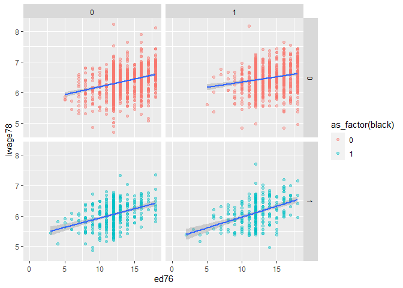

This is a markdown file created using RStudio.

### Using Packeges
I used these packages to create the data:


```r
library(tidyverse)
library(knitr)
library(magrittr)
library(MASS)
library(qwraps2)
library(gtsummary)
```


## Tidy the Data
### Importing Data
 
I used the data from [David Card's website](https://davidcard.berkeley.edu/data_sets.html) 
The relevant file is `nls.dat` saved in the `Data` directory.


```r
data <- read.table("Data/nls.dat") %>% as_data_frame()
head(data)
```

<div data-pagedtable="false">
  <script data-pagedtable-source type="application/json">
{"columns":[{"label":["V1"],"name":[1],"type":["int"],"align":["right"]},{"label":["V2"],"name":[2],"type":["int"],"align":["right"]},{"label":["V3"],"name":[3],"type":["int"],"align":["right"]},{"label":["V4"],"name":[4],"type":["int"],"align":["right"]},{"label":["V5"],"name":[5],"type":["int"],"align":["right"]},{"label":["V6"],"name":[6],"type":["int"],"align":["right"]},{"label":["V7"],"name":[7],"type":["int"],"align":["right"]},{"label":["V8"],"name":[8],"type":["int"],"align":["right"]},{"label":["V9"],"name":[9],"type":["dbl"],"align":["right"]},{"label":["V10"],"name":[10],"type":["int"],"align":["right"]},{"label":["V11"],"name":[11],"type":["dbl"],"align":["right"]},{"label":["V12"],"name":[12],"type":["int"],"align":["right"]},{"label":["V13"],"name":[13],"type":["int"],"align":["right"]},{"label":["V14"],"name":[14],"type":["int"],"align":["right"]},{"label":["V15"],"name":[15],"type":["int"],"align":["right"]},{"label":["V16"],"name":[16],"type":["int"],"align":["right"]},{"label":["V17"],"name":[17],"type":["int"],"align":["right"]},{"label":["V18"],"name":[18],"type":["int"],"align":["right"]},{"label":["V19"],"name":[19],"type":["int"],"align":["right"]},{"label":["V20"],"name":[20],"type":["int"],"align":["right"]},{"label":["V21"],"name":[21],"type":["int"],"align":["right"]},{"label":["V22"],"name":[22],"type":["int"],"align":["right"]},{"label":["V23"],"name":[23],"type":["int"],"align":["right"]},{"label":["V24"],"name":[24],"type":["int"],"align":["right"]},{"label":["V25"],"name":[25],"type":["int"],"align":["right"]},{"label":["V26"],"name":[26],"type":["int"],"align":["right"]},{"label":["V27"],"name":[27],"type":["int"],"align":["right"]},{"label":["V28"],"name":[28],"type":["int"],"align":["right"]},{"label":["V29"],"name":[29],"type":["chr"],"align":["left"]},{"label":["V30"],"name":[30],"type":["chr"],"align":["left"]},{"label":["V31"],"name":[31],"type":["int"],"align":["right"]},{"label":["V32"],"name":[32],"type":["int"],"align":["right"]},{"label":["V33"],"name":[33],"type":["int"],"align":["right"]},{"label":["V34"],"name":[34],"type":["chr"],"align":["left"]},{"label":["V35"],"name":[35],"type":["int"],"align":["right"]},{"label":["V36"],"name":[36],"type":["chr"],"align":["left"]},{"label":["V37"],"name":[37],"type":["chr"],"align":["left"]},{"label":["V38"],"name":[38],"type":["int"],"align":["right"]},{"label":["V39"],"name":[39],"type":["chr"],"align":["left"]},{"label":["V40"],"name":[40],"type":["chr"],"align":["left"]},{"label":["V41"],"name":[41],"type":["chr"],"align":["left"]},{"label":["V42"],"name":[42],"type":["int"],"align":["right"]},{"label":["V43"],"name":[43],"type":["int"],"align":["right"]},{"label":["V44"],"name":[44],"type":["int"],"align":["right"]},{"label":["V45"],"name":[45],"type":["chr"],"align":["left"]},{"label":["V46"],"name":[46],"type":["chr"],"align":["left"]},{"label":["V47"],"name":[47],"type":["chr"],"align":["left"]},{"label":["V48"],"name":[48],"type":["chr"],"align":["left"]},{"label":["V49"],"name":[49],"type":["chr"],"align":["left"]},{"label":["V50"],"name":[50],"type":["chr"],"align":["left"]},{"label":["V51"],"name":[51],"type":["chr"],"align":["left"]},{"label":["V52"],"name":[52],"type":["chr"],"align":["left"]}],"data":[{"1":"2","2":"0","3":"0","4":"0","5":"0","6":"7","7":"5","8":"29","9":"9.94","10":"1","11":"10.25","12":"1","13":"158413","14":"1","15":"0","16":"0","17":"1","18":"0","19":"0","20":"0","21":"0","22":"0","23":"0","24":"0","25":"0","26":"0","27":"1","28":"1","29":"6.30627529","30":"6.07484616","31":"9","32":"1","33":"1","34":"1","35":"0","36":"0","37":"0","38":"1","39":"548","40":"500","41":"755","42":"0","43":"0","44":"0","45":"0","46":"0","47":"15","48":".","49":"1","50":"1","51":"1","52":"0"},{"1":"3","2":"0","3":"0","4":"0","5":"0","6":"12","7":"11","8":"27","9":"8.00","10":"0","11":"8.00","12":"0","13":"380166","14":"1","15":"0","16":"0","17":"1","18":"0","19":"0","20":"0","21":"0","22":"0","23":"0","24":"0","25":"0","26":"0","27":"1","28":"0","29":"6.17586727","30":".","31":"8","32":"0","33":"1","34":"1","35":"0","36":"0","37":"0","38":"1","39":"481","40":".","41":"769","42":"0","43":"0","44":"0","45":"0","46":"0","47":"35","48":"93","49":"1","50":"4","51":"4","52":"1"},{"1":"4","2":"0","3":"0","4":"0","5":"0","6":"12","7":"12","8":"34","9":"14.00","10":"0","11":"12.00","12":"0","13":"367470","14":"1","15":"0","16":"0","17":"1","18":"0","19":"0","20":"0","21":"0","22":"0","23":"0","24":"0","25":"0","26":"0","27":"1","28":"0","29":"6.58063914","30":".","31":"2","32":"0","33":"1","34":".","35":"0","36":".","37":".","38":"1","39":"721","40":".","41":".","42":"1","43":"1","44":"0","45":".","46":".","47":"42","48":"103","49":"1","50":".","51":".","52":"1"},{"1":"5","2":"1","3":"1","4":"1","5":"0","6":"11","7":"11","8":"27","9":"11.00","10":"0","11":"12.00","12":"0","13":"380166","14":"1","15":"0","16":"0","17":"0","18":"1","19":"0","20":"0","21":"0","22":"0","23":"0","24":"0","25":"0","26":"0","27":"1","28":"0","29":"5.52146092","30":".","31":"6","32":"0","33":"1","34":".","35":"0","36":".","37":"0","38":"1","39":"250","40":".","41":".","42":"1","43":"0","44":"0","45":".","46":"0","47":"25","48":"88","49":"1","50":".","51":"5","52":"1"},{"1":"6","2":"1","3":"1","4":"1","5":"0","6":"12","7":"12","8":"34","9":"8.00","10":"0","11":"7.00","12":"0","13":"367470","14":"1","15":"0","16":"0","17":"0","18":"1","19":"0","20":"0","21":"0","22":"0","23":"0","24":"0","25":"0","26":"0","27":"1","28":"1","29":"6.59167373","30":"6.54484979","31":"8","32":"0","33":"1","34":"1","35":"0","36":"0","37":".","38":"1","39":"729","40":"800","41":".","42":"0","43":"1","44":"0","45":"0","46":".","47":"34","48":"108","49":"1","50":"1","51":".","52":"0"},{"1":"7","2":"1","3":"1","4":"1","5":"0","6":"12","7":"11","8":"26","9":"9.00","10":"0","11":"12.00","12":"0","13":"380166","14":"1","15":"0","16":"0","17":"0","18":"1","19":"0","20":"0","21":"0","22":"0","23":"0","24":"0","25":"0","26":"0","27":"1","28":"1","29":"6.21460810","30":"6.19351769","31":"6","32":"0","33":"1","34":"1","35":"0","36":"0","37":"0","38":"1","39":"500","40":"563","41":"630","42":"0","43":"0","44":"0","45":"0","46":"0","47":"38","48":"85","49":"1","50":"4","51":"4","52":"1"}],"options":{"columns":{"min":{},"max":[10]},"rows":{"min":[10],"max":[10]},"pages":{}}}
  </script>
</div>
### Changing col names & type

Using variable names from `code_bk.txt'


```r
colnames(data) <-(c("id","nearc","nearc4","nearc4a","nearc4b","ed76","ed66  ","age76","daded ","nodaded","momed","nomomed","weight","momdad14 ","sinmom14","step14","reg661","reg662","reg663","reg66","reg665","reg666","reg667","reg668","reg669","south66","work76","work78","lwage7","lwage78","famed","black","smsa76r","smsa78r","reg76r","reg78r","reg80r","smsa66r","wage76","wage78","wage80","noint78","noint80","enroll76","enroll78","enroll80","kww","iq","marsta76","marsta78","marsta80","libcrd14"))

data %<>% mutate_if(is_character,suppressWarnings(as.numeric))
 
data_summary <- data[-1] %>%
  summarise_all(list(
    Min = min, 
    Mean = mean, 
    Max = max,
    SD = sd)) %>%
  pivot_longer(everything(),
               names_to = c("Var","Stat"),
               names_sep = "_") %>%
  pivot_wider(names_from = "Stat") %>% column_to_rownames("Var") 
data_summary %>% format(scientific = FALSE, digits = 2,trim = TRUE)
```

<div data-pagedtable="false">
  <script data-pagedtable-source type="application/json">
{"columns":[{"label":[""],"name":["_rn_"],"type":[""],"align":["left"]},{"label":["Min"],"name":[1],"type":["I<chr>"],"align":["right"]},{"label":["Mean"],"name":[2],"type":["I<chr>"],"align":["right"]},{"label":["Max"],"name":[3],"type":["I<chr>"],"align":["right"]},{"label":["SD"],"name":[4],"type":["I<chr>"],"align":["right"]}],"data":[{"1":"0","2":"0.432","3":"1","4":"0.50","_rn_":"nearc"},{"1":"0","2":"0.678","3":"1","4":"0.47","_rn_":"nearc4"},{"1":"0","2":"0.492","3":"1","4":"0.50","_rn_":"nearc4a"},{"1":"0","2":"0.186","3":"1","4":"0.39","_rn_":"nearc4b"},{"1":"0","2":"13.225","3":"18","4":"2.75","_rn_":"ed76"},{"1":"0","2":"10.743","3":"18","4":"2.46","_rn_":"ed66"},{"1":"24","2":"28.175","3":"34","4":"3.17","_rn_":"age76"},{"1":"0","2":"10.003","3":"18","4":"3.30","_rn_":"daded"},{"1":"0","2":"0.224","3":"1","4":"0.42","_rn_":"nodaded"},{"1":"0","2":"10.342","3":"18","4":"3.03","_rn_":"momed"},{"1":"0","2":"0.114","3":"1","4":"0.32","_rn_":"nomomed"},{"1":"75607","2":"320318.351","3":"1752340","4":"168006.76","_rn_":"weight"},{"1":"0","2":"0.792","3":"1","4":"0.41","_rn_":"momdad14"},{"1":"0","2":"0.100","3":"1","4":"0.30","_rn_":"sinmom14"},{"1":"0","2":"0.038","3":"1","4":"0.19","_rn_":"step14"},{"1":"0","2":"0.045","3":"1","4":"0.21","_rn_":"reg661"},{"1":"0","2":"0.155","3":"1","4":"0.36","_rn_":"reg662"},{"1":"0","2":"0.194","3":"1","4":"0.40","_rn_":"reg663"},{"1":"0","2":"0.069","3":"1","4":"0.25","_rn_":"reg66"},{"1":"0","2":"0.210","3":"1","4":"0.41","_rn_":"reg665"},{"1":"0","2":"0.093","3":"1","4":"0.29","_rn_":"reg666"},{"1":"0","2":"0.110","3":"1","4":"0.31","_rn_":"reg667"},{"1":"0","2":"0.031","3":"1","4":"0.17","_rn_":"reg668"},{"1":"0","2":"0.094","3":"1","4":"0.29","_rn_":"reg669"},{"1":"0","2":"0.413","3":"1","4":"0.49","_rn_":"south66"},{"1":"0","2":"0.835","3":"1","4":"0.37","_rn_":"work76"},{"1":"0","2":"0.735","3":"1","4":"0.44","_rn_":"work78"},{"1":"__NA__","2":"__NA__","3":"__NA__","4":"__NA__","_rn_":"lwage7"},{"1":"__NA__","2":"__NA__","3":"__NA__","4":"__NA__","_rn_":"lwage78"},{"1":"1","2":"5.913","3":"9","4":"2.65","_rn_":"famed"},{"1":"0","2":"0.230","3":"1","4":"0.42","_rn_":"black"},{"1":"0","2":"0.695","3":"1","4":"0.46","_rn_":"smsa76r"},{"1":"__NA__","2":"__NA__","3":"__NA__","4":"__NA__","_rn_":"smsa78r"},{"1":"0","2":"0.400","3":"1","4":"0.49","_rn_":"reg76r"},{"1":"__NA__","2":"__NA__","3":"__NA__","4":"__NA__","_rn_":"reg78r"},{"1":"__NA__","2":"__NA__","3":"__NA__","4":"__NA__","_rn_":"reg80r"},{"1":"0","2":"0.643","3":"1","4":"0.48","_rn_":"smsa66r"},{"1":"__NA__","2":"__NA__","3":"__NA__","4":"__NA__","_rn_":"wage76"},{"1":"__NA__","2":"__NA__","3":"__NA__","4":"__NA__","_rn_":"wage78"},{"1":"__NA__","2":"__NA__","3":"__NA__","4":"__NA__","_rn_":"wage80"},{"1":"0","2":"0.081","3":"1","4":"0.27","_rn_":"noint78"},{"1":"0","2":"0.107","3":"1","4":"0.31","_rn_":"noint80"},{"1":"0","2":"0.095","3":"1","4":"0.29","_rn_":"enroll76"},{"1":"__NA__","2":"__NA__","3":"__NA__","4":"__NA__","_rn_":"enroll78"},{"1":"__NA__","2":"__NA__","3":"__NA__","4":"__NA__","_rn_":"enroll80"},{"1":"__NA__","2":"__NA__","3":"__NA__","4":"__NA__","_rn_":"kww"},{"1":"__NA__","2":"__NA__","3":"__NA__","4":"__NA__","_rn_":"iq"},{"1":"__NA__","2":"__NA__","3":"__NA__","4":"__NA__","_rn_":"marsta76"},{"1":"__NA__","2":"__NA__","3":"__NA__","4":"__NA__","_rn_":"marsta78"},{"1":"__NA__","2":"__NA__","3":"__NA__","4":"__NA__","_rn_":"marsta80"},{"1":"__NA__","2":"__NA__","3":"__NA__","4":"__NA__","_rn_":"libcrd14"}],"options":{"columns":{"min":{},"max":[10]},"rows":{"min":[10],"max":[10]},"pages":{}}}
  </script>
</div>


```r
data %>% ggplot(aes(ed76,lwage78)) +
  geom_point(aes(
    color = as_factor(black)),
    alpha =0.4 ) +
  geom_smooth(method = lm)+
  facet_grid(cols = vars(as_factor(nearc)),rows = vars(as_factor(black)))
```

<!-- -->

```r
data %>% ggplot(aes(ed76,lwage78)) + 
  geom_point(aes(
    color = as_factor(nearc)),
    alpha = 0.4)+
  geom_smooth(method = lm)
```

<!-- -->


```

data
